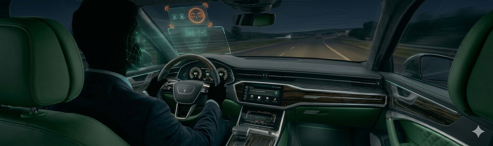
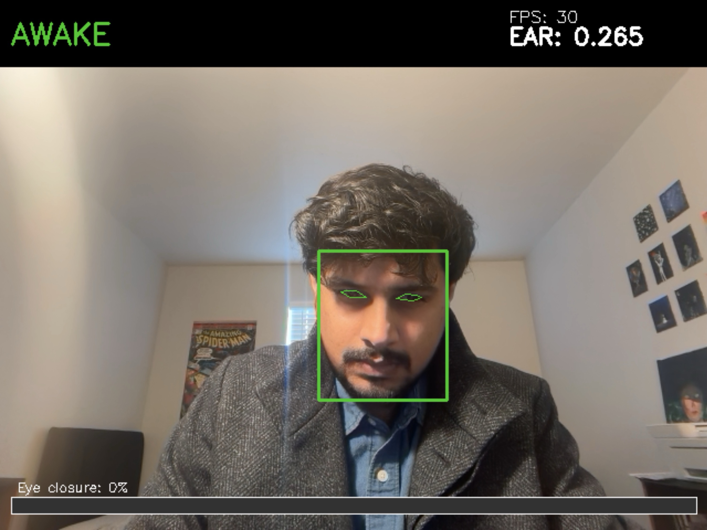

<h1 align="center">Driver Drowsiness Detection System</h1>

<p align="center">
  
</p>

<p align="center">
  Real-time eye-closure monitoring and drowsiness alerting using computer vision
</p>

<p align="center">
  
  
  
  
  
</p>

---

## Problem

Drowsy driving is one of the leading causes of road accidents worldwide. The National Highway Traffic Safety Administration estimates that drowsiness is a factor in over 100,000 crashes per year in the US alone. Most of these incidents happen because there is no mechanism to detect the early signs of driver fatigue and intervene before it is too late.

This project builds a **real-time driver drowsiness detection system** that continuously monitors a driver's eyes through a standard camera, detects when the eyes remain closed for a dangerous duration, and triggers an immediate audio and visual alarm.

---

## What This System Does

The current baseline system implements a complete, working pipeline:

- **Detects the driver's face** in each video frame using MediaPipe's neural face landmark model
- **Extracts eye coordinates** from 478-point face mesh landmarks (6 points per eye)
- **Computes the Eye Aspect Ratio (EAR)** — a geometric measure of eye openness
- **Tracks eye closure over time** — counts consecutive frames where EAR falls below a threshold
- **Triggers an alarm** when eyes remain closed for more than 3 seconds (configurable)
- **Displays a real-time overlay** with face bounding box, eye contours, EAR value, FPS counter, and a drowsiness progress bar
- **Logs session events** including drowsiness alerts, blink counts, and event durations

It works with a **live webcam** or a **pre-recorded video file**, runs at 30+ FPS on CPU, and requires no GPU.

---

## How It Works

The system is built around the **Eye Aspect Ratio (EAR)** algorithm from the [Soukupova & Cech (2016)](https://vision.fe.uni-lj.si/cvww2016/proceedings/papers/05.pdf) paper.

EAR is a simple geometric ratio computed from the six landmark points of each eye:

```
EAR = (||p2 - p6|| + ||p3 - p5||) / (2 × ||p1 - p4||)
```

When the eye is open, EAR stays in the range of **0.25–0.35**. When closed, it drops below **~0.20**. By tracking this value frame-by-frame and counting how long it stays below a threshold, the system determines whether the driver's eyes have been shut for a dangerously long time.

### Pipeline

```
Camera Feed → Face Detection (MediaPipe) → 478-Point Landmark Extraction
    → Eye Region Isolation (6 pts/eye) → EAR Computation
    → Temporal Tracking (frame counter) → Drowsiness State Machine
    → Alarm Trigger (audio + visual) → Annotated Display Output
```

### Why EAR?

| Approach | Accuracy | Speed | Complexity | Trade-off |
|----------|----------|-------|------------|-----------|
| Haar Cascades | Low | Fast | Minimal | No landmarks, high false-positive rate |
| dlib HOG + EAR | High | ~30 FPS | Requires CMake/C++ compilation | Breaks on Python 3.13 |
| **MediaPipe + EAR** | **High** | **~30 FPS** | **Pure pip install** | **Best balance for this project** |
| CNN eye-state classifier | Higher | ~15–25 FPS | Needs labeled training data | Overkill for sustained-closure detection |

The EAR approach achieves strong accuracy for sustained eye-closure detection without requiring any training data, GPU hardware, or model compilation. MediaPipe provides the landmark backbone with a simple `pip install`, making the project reproducible on any platform.

---

## Demo

<p align="center">
  
</p>

---

## Repository Structure

```
├── main.py                        Entry point — runs the full detection pipeline
│
├── src/
│   ├── config.py                  Centralized configuration and defaults
│   ├── face_detector.py           MediaPipe Tasks API face + landmark detection
│   ├── eye_tracker.py             EAR computation from eye landmarks
│   ├── drowsiness_tracker.py      Temporal state machine (AWAKE → DROWSY)
│   ├── alarm.py                   Non-blocking audio alarm (pygame)
│   ├── visualizer.py              Real-time UI overlay and annotations
│   └── logger.py                  Session event logging
│
├── scripts/
│   ├── generate_alarm.py          Generates the alarm .wav file
│   └── calibrate_ear.py           Interactive EAR threshold calibration tool
│
├── tests/
│   ├── test_eye_tracker.py        Unit tests for EAR computation
│   └── test_drowsiness_tracker.py Unit tests for state machine logic
│
├── assets/                        Alarm sound + MediaPipe model (auto-downloaded)
├── data/sample_videos/            Place test videos here
├── logs/                          Session logs (auto-created at runtime)
├── docs/                          Documentation and visuals
│
├── requirements.txt               Python dependencies
├── LICENSE                        MIT License
└── .gitignore
```

---

## Getting Started

### Prerequisites

- Python 3.10 or higher (fully tested on 3.13)
- A webcam or a video file
- No GPU, CMake, or compilation required

### Installation

```bash
git clone https://github.com/aman-720/Gaze-Tracker-Real-time-Face-and-Eye-Detection.git
cd Gaze-Tracker-Real-time-Face-and-Eye-Detection
```

```bash
python -m venv venv
source venv/bin/activate        # macOS / Linux
# venv\Scripts\activate         # Windows
```

```bash
pip install -r requirements.txt
python scripts/generate_alarm.py
```

On first run, the system automatically downloads the MediaPipe face landmark model (~1.5 MB).

### Usage

```bash
# Run with webcam (default)
python main.py

# Run on a video file
python main.py --source path/to/video.mp4

# Adjust detection sensitivity
python main.py --ear-threshold 0.25 --closed-time 2.5

# Record annotated output
python main.py --record output.avi

# Headless mode (no GUI, alarm only — useful for embedded devices)
python main.py --no-display

# Disable audio alarm (visual alert only)
python main.py --no-alarm
```

Press **`q`** or **`Esc`** to quit.

### CLI Reference

| Argument | Default | Description |
|----------|---------|-------------|
| `--source` | `0` (webcam) | Video source — device index or file path |
| `--ear-threshold` | `0.22` | EAR value below which eyes are considered closed |
| `--closed-time` | `3.0` | Seconds of sustained closure before alarm triggers |
| `--record` | None | Output file path to save annotated video |
| `--no-display` | Off | Run without the GUI window |
| `--no-alarm` | Off | Disable audio alarm |

---

## EAR Calibration

The default EAR threshold of **0.22** works for most faces, but every person's eye geometry is different. Someone with naturally narrow eyes might have an open-eye EAR of 0.23, which would cause constant false alarms. Someone with larger eyes might sit at 0.32 when open, meaning 0.22 is perfect.

The calibration tool measures your personal EAR range and recommends a threshold:

```bash
python scripts/calibrate_ear.py
```

Look at the camera with your eyes open normally for a few seconds, then close them for a few seconds. The tool shows your live EAR values and at the end reports your min, max, and mean. A good threshold is roughly halfway between your closed-eye EAR and your average open-eye EAR.

```bash
# Use your calibrated value
python main.py --ear-threshold 0.19
```

---

## Configuration

All tunable parameters are centralized in `src/config.py`:

| Parameter | Default | What It Controls |
|-----------|---------|------------------|
| `ear_threshold` | `0.22` | EAR below this value = eyes considered closed |
| `closed_frames_threshold` | `90` | Consecutive closed frames before alarm (~3s at 30 FPS) |
| `alarm_cooldown_sec` | `5.0` | Minimum gap between repeated alarm triggers |
| `frame_width` | `640` | Processing resolution (width) |
| `frame_height` | `480` | Processing resolution (height) |
| `min_detection_confidence` | `0.5` | MediaPipe face detection confidence threshold |
| `min_tracking_confidence` | `0.5` | MediaPipe landmark tracking confidence threshold |

All detection parameters can also be overridden via command-line arguments.

---

## Running Tests

```bash
python -m pytest tests/ -v
```

The test suite covers EAR computation correctness (open eye, closed eye, edge cases, asymmetric values) and the full drowsiness state machine (state transitions, blink counting, event logging, reset behavior).

---

## System Requirements

| | Minimum | Recommended |
|---|---|---|
| **CPU** | Intel i3 / AMD Ryzen 3 / Apple M1 | Intel i5+ / Apple M1+ |
| **RAM** | 4 GB | 8 GB |
| **GPU** | Not required | Not required |
| **Camera** | Any USB webcam | 720p+ webcam |
| **OS** | macOS, Linux, Windows | macOS (Apple Silicon), Ubuntu 22+ |

---

## Limitations

- **Head orientation:** Works best with frontal or near-frontal face position. Extreme head turns beyond ~45° may cause detection drops.
- **Lighting:** Performance degrades in very dark environments or with strong backlighting. Standard indoor/outdoor daylight works well.
- **Single driver:** Tracks one face at a time. In multi-face scenarios, it uses the first face detected by MediaPipe.
- **Audio output:** The alarm requires speakers or headphones to be audible.
- **Eyewear:** Thick-framed sunglasses or heavily tinted lenses can interfere with eye landmark detection.

---

## Use Cases

- **Personal safety tool** for long-distance drivers and night-shift commuters
- **Fleet management** integration for commercial trucking and logistics companies
- **Research baseline** for driver monitoring and fatigue detection studies
- **Educational project** demonstrating real-time computer vision pipelines, facial landmark analysis, and temporal state tracking
- **Prototype foundation** for embedded vehicle safety systems (Raspberry Pi, Jetson Nano)

---

## Planned Enhancements

The following features are **not yet implemented** but are planned as next-phase improvements to expand the system's detection capabilities beyond eye-closure monitoring alone.

### Yawning Detection

Yawning is one of the earliest and most reliable physiological indicators of drowsiness — it typically appears well before a driver's eyes begin to close. The planned implementation will compute a **Mouth Aspect Ratio (MAR)** from MediaPipe's mouth landmarks, using the same geometric approach as EAR. When the mouth opens beyond a threshold width-to-height ratio for a sustained duration, it registers as a yawn. This adds a **predictive early-warning signal** that the current eye-only system cannot capture. A driver who yawns repeatedly may still have their eyes open, but the pattern strongly indicates increasing fatigue.

### PERCLOS (Percentage of Eye Closure)

PERCLOS is the **clinical gold standard** for measuring drowsiness, used in formal fatigue research and by regulatory bodies like the FMCSA. Instead of triggering only when eyes are continuously closed for N seconds, PERCLOS measures what **percentage of a rolling time window** (typically 60 seconds) the eyes were closed. A PERCLOS score above 0.15–0.20 indicates significant drowsiness even if the driver never fully falls asleep. This metric catches the pattern of **frequent long blinks and microsleeps** — a critical danger zone that the current frame-counter approach can miss if the driver briefly opens their eyes between closures.

### Head Pose Estimation

A drowsy or inattentive driver often exhibits head nodding, sustained head tilting, or turning away from the road — all of which can occur while the eyes remain open. Head pose estimation uses the 3D coordinates already available from MediaPipe's face mesh to compute the **pitch, yaw, and roll** of the driver's head in real time. This adds an entirely **independent detection channel** that does not rely on eye state at all, making the system more robust against scenarios where eye tracking alone is insufficient (e.g., sunglasses, poor lighting, or certain face geometries).

---

## References

- Soukupova, T. & Cech, J. (2016). "Real-Time Eye Blink Detection using Facial Landmarks." *Computer Vision Winter Workshop.*
- Lugaresi, C. et al. (2019). "MediaPipe: A Framework for Building Perception Pipelines." *CVPR Workshop on Computer Vision for AR/VR.*

---

## License

This project is licensed under the MIT License. See [LICENSE](LICENSE) for details.

---

<p align="center">
  Built by <a href="https://github.com/aman-720">Aman Pandey</a>
</p>
